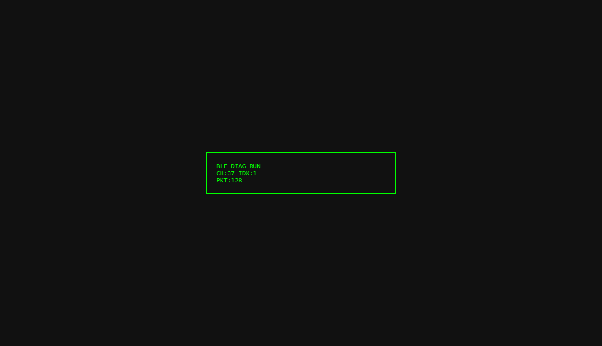

# zmk-ble-diag

나이스나노 v2 / XIAO nRF52840용 BLE 진단 펌웨어 스켈레톤입니다.

## 구현 내용
- USB-C 전원 인가 후 자동 진단 시작 (`main()` 즉시 수행)
- 슬립 없이 무한 루프에서 로그 기록 유지
- 5개 채널 슬롯 순환 진단: `37 -> 38 -> 39 -> 0 -> 20`
- SSD1306(128x64, I2C 0x3C)에 현재 진단 상태 표시
- 보드별 오버레이 분리
  - `/home/runner/work/zmk-ble-diag/zmk-ble-diag/boards/shields/nice_nano_v2_ble_diag.overlay`
  - `/home/runner/work/zmk-ble-diag/zmk-ble-diag/boards/shields/xiao_nrf52840_ble_diag.overlay`

## SSD1306 배선
자세한 배선은 아래 문서 참고:
- `/home/runner/work/zmk-ble-diag/zmk-ble-diag/docs/pinout.md`

요약:
- VCC -> 3V3
- GND -> GND
- SDA -> SDA
- SCL -> SCL

## 상태 표시 예시
- 1행: `BLE DIAG RUN`
- 2행: `CH:<채널> IDX:<1~5>`
- 3행: `PKT:<현재 슬롯 누적 패킷>`



외부 공유용 이미지 URL:
- https://github.com/user-attachments/assets/b8a389e1-5abc-4fe3-bf66-49021b95de75

## 빌드 예시 (Zephyr)
```bash
west build -b nice_nano_v2 /home/runner/work/zmk-ble-diag/zmk-ble-diag -DDTC_OVERLAY_FILE=/home/runner/work/zmk-ble-diag/zmk-ble-diag/boards/shields/nice_nano_v2_ble_diag.overlay
west build -b xiao_ble /home/runner/work/zmk-ble-diag/zmk-ble-diag -DDTC_OVERLAY_FILE=/home/runner/work/zmk-ble-diag/zmk-ble-diag/boards/shields/xiao_nrf52840_ble_diag.overlay
```
